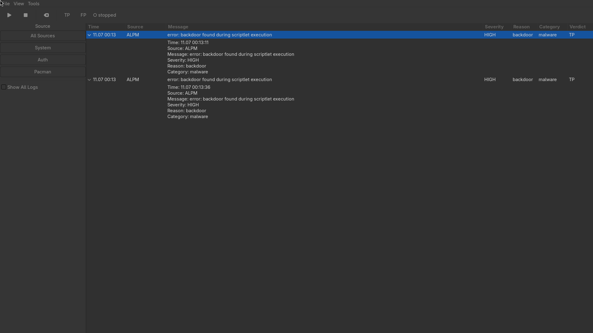
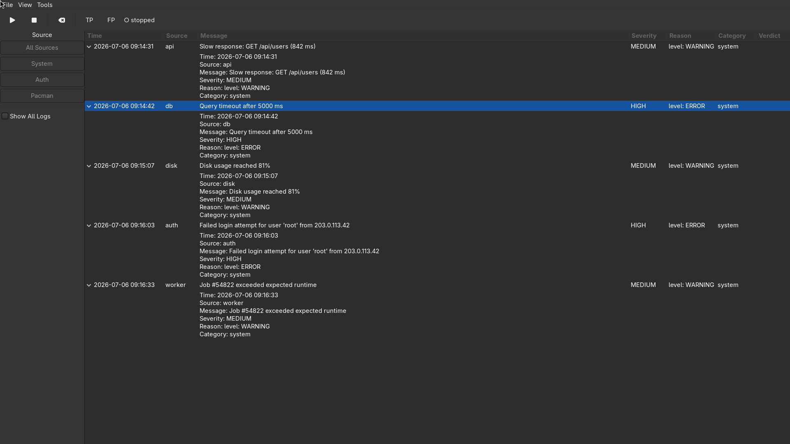
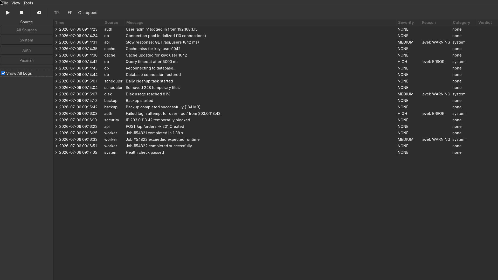
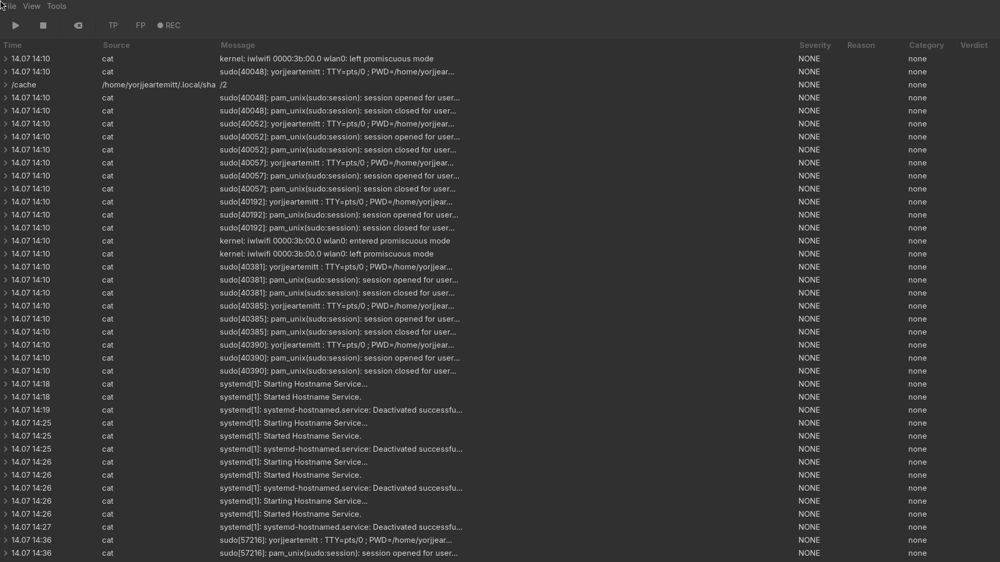
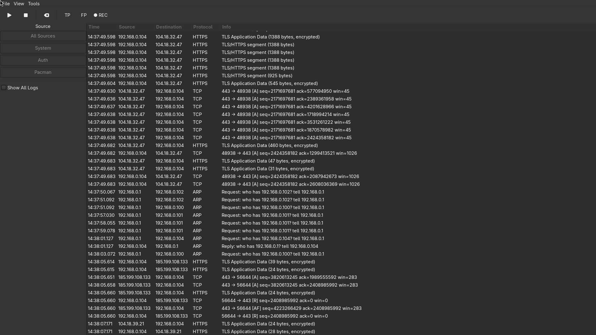

# SIEM

<p align="center">

# GTK3 Security Information and Event Management Prototype

A desktop SIEM application written entirely in **C** for Linux.

Built to understand how modern Security Information and Event Management systems work internally by implementing log collection, alert correlation, packet inspection, and protocol parsing from scratch.

</p>

---

## About

This project is an educational implementation of a lightweight SIEM.

Instead of relying on enterprise platforms like Splunk, Wazuh or Elastic, the goal was to implement the core components manually:

- Log collection
- Log parsing
- Alert detection
- Rule engine
- Packet capture
- Protocol parsing
- SQLite persistence
- GTK3 desktop interface

Real Linux system logs are used as data sources together with live network traffic captured through **libpcap**.

---

# Stack

<div align="center">


</div>

---

# Features

## Log Collection

- Live monitoring of `journalctl`
- Incremental parsing of `auth.log`
- Incremental parsing of `pacman.log`
- Import custom log files
- Incremental reading without reprocessing entire files

---

## Detection Engine

- Rule-based alert engine
- ~35 detection rules
- Whole-word keyword matching
- Automatic severity classification
- Automatic category classification
- Baseline detection using log levels
- Reduced false positives for routine pacman operations

### Severity Levels

- CRITICAL
- HIGH
- MEDIUM
- LOW

## Dependencies

**Arch Linux:**
```sh
sudo pacman -S gtk3 cmake pkgconf
```

**Ubuntu/Debian:**
```sh
sudo apt install libgtk-3-dev cmake pkg-config
```

## Build & Run

```sh
git clone https://github.com/yorjjeartemitt/SIEM.git
cd SIEM

./run gcc     # build with gcc and run
./run cmake   # build with cmake and run
./run docker  # run in docker
```

# Screenshots

## Alert Detection



---

## Open Custom Log File



---

## Imported Log View



---

## Live journalctl Monitoring



---

## Network Monitoring



### Categories

- Authentication
- Network
- Malware
- Integrity
- Reconnaissance
- System

---

## Network Monitoring

Live packet capture using **libpcap**.

Supported protocols:

- HTTP
- HTTPS
- DNS
- DHCP
- FTP
- SMTP
- POP3
- IMAP
- LDAP
- LDAPS
- MySQL
- PostgreSQL
- MongoDB
- SMB
- ICMP
- ARP

Features include:

- Live packet capture
- Protocol identification
- Basic application-layer parsing
- Detection of insecure cleartext protocols
- TLS ClientHello / SNI parsing
- DNS query and response parsing

---

## Database

SQLite stores:

- Alerts
- TP / FP verdicts
- Application settings
- User preferences
- UI state

---

## User Interface

GTK3 desktop application featuring:

- Live monitoring
- Expandable event details
- CSV export
- Pagination
- Dark / Light theme
- Fullscreen mode
- Toggleable sidebar
- Toggleable columns
- Multiple log sources
- Alert filtering
